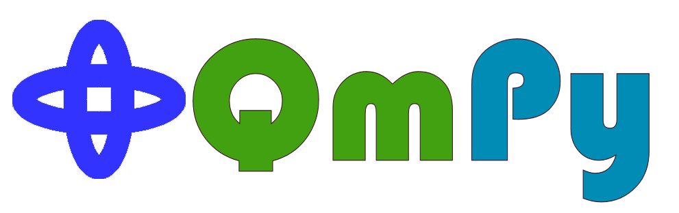
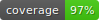
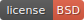
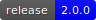

# 

 
 


QmPy is a python package containing routines to numerically solve and visualize
the schroedinger equation for different potentials.


## Disclaimer

This is a student project. It utilizes very unstable and simple numerical
algorithms.

## Requirements

This package requires Python 3.6 or higher and the packages numpy, scipy,
matplotlib and os.

## Installation

For easy installation with pip use:

```shell
pip install -i https://test.pypi.org/simple/ qmpy-schrodinger==1.0.0
```

## Usage

Calculating the first four energies and wavefunctions of a particle in a box
aswell as the expected values and uncertainties for the x-xoordinate for each
state.

```python

from qmpy.solvers import schroedinger, calculate_expval, calculate_uncertainty
from numpy import linspace, zeros

mass = 2.0
xcords = linspace(-2, 2, 1999)
pot = zeros((1999, ))

xcoords = linspace(-2, 2, 1999)
# returns the first four energies and wavefunctions
energies, wfuncs = schroedinger(mass, xcoords, pot, select_range=(0, 3))

# calculate the expected value for the x-coordinate for each state
expvals = calculate_expval(xcoords, wfuncs)

# calculate the uncertainty of the x-coordinate for each state
uncs = calculate_uncertainty(xcoords, wfuncs)

```

Plotting numerical data contained in a directory

```python

from qmpy.graphics import qm_plottings

# directory containing the files potential.dat, energies.dat,
# wavefuncs.dat, and expvalues.dat.
datadir = 'myqmdata'

# plot the data and save the plot as 'my_plot.png'
qm_plottings(datadir, sname='my_plot.png')

```


## Documentation

The documentation can be found at [qmpy.org/docs](http://qmpy.org/docs/).

## Contributing

Contributions are always welcome. To contribute fork the repository from
github and develop your feature including unit tests. For your contribution
to be incorporated in the main build issue a pull request.

## License

[BSD 2-Clause License](https://choosealicense.com/licenses/bsd-2-clause/) <br/>
See LICENSE.txt for further information.
