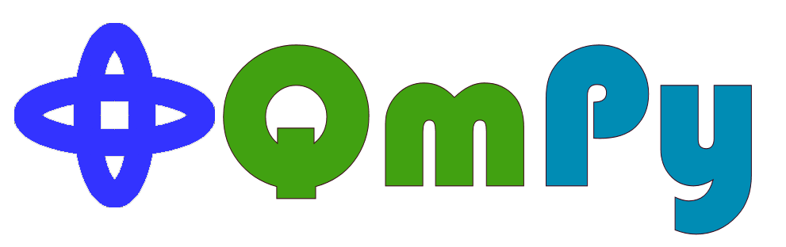

.. QmPy documentation master file, created by
   sphinx-quickstart on Wed Aug  5 10:22:35 2020.
   You can adapt this file completely to your liking, but it should at least
   contain the root `toctree` directive.

QmPy is a python package containing routines to numerically solve and visualize
the schroedinger equation for different potentials.

Documentation
*************

.. toctree::
   :maxdepth: 1

   api

Requirements
************

This package requires Python 3.6 or higher and the packages numpy, scipy,
matplotlib and os.

Installation
************

For easy installation with pip use:

.. code-block:: shell

   pip install -i https://test.pypi.org/simple/ qmpy-schrodinger==2.0.0

Code Example
************
.. toctree::
   :maxdepth: 1

   qmsolve

Indices and tables
******************

* :ref:`genindex`
* :ref:`modindex`
* :ref:`search`
